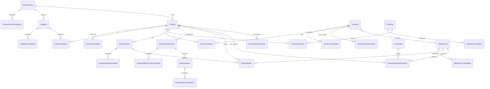

# Modelo de datos — persistencia core

Capa de persistencia del Módulo 05. PostgreSQL administrado por Supabase,
accedido solo desde Next.js server-side mediante Prisma.

La Home pública **no** lee esta base todavía. Sigue usando
`src/modules/home/demo/*`.

## Principios

- Identificadores internos: UUID.
- URLs públicas futuras: slugs localizados, no UUID visibles.
- Timestamps: `timestamptz`, persistidos en UTC.
- Locales: `String` (`es-MX`, `en-US`). La aplicación valida contra
  `supportedLocales`. No hay enum Prisma de idiomas.
- Dinero maestro: enteros `priceMinor` en MXN. `$450.00` → `45000`.
  `null` = sin precio (p. ej. `CUSTOM_QUOTE`). `0` no significa “sin precio”.
- Media: `bucket` + `objectPath`. La URL pública no es fuente de verdad.
- Producto operativo = `ARCHIVED`. No hay soft-delete universal.
- Sin carrito, pedidos, pagos, clientes, auth, inventario, footer/CMS.

## Entidades

### Taxonomía

| Entidad | Rol |
| --- | --- |
| `BusinessLine` | Línea de negocio (pastelería, etc.) |
| `Category` | Categoría dentro de una línea |
| `Universe` | Universo temático genérico (sin IP de terceros) |
| `Collection` | Colección temporal o editorial (`startsAt` / `endsAt` opcionales) |

Cada una tiene una tabla `*Translation` (`locale`, `name`, `slug`,
`description?`) con `unique(parentId, locale)` y `unique(locale, slug)`.

### Producto

`Product` no guarda nombre visible. Campos de negocio: `type`, `status`,
`businessLineId`, `minimumLeadTimeMinutes?`, `publishedAt?`, `archivedAt?`.

`ProductTranslation` aporta `name`, `slug`, descripciones y SEO por locale.

Uniones explícitas:

- `ProductCategory`
- `ProductUniverse`
- `ProductCollection`

### Variante y opciones

`ProductVariant` es la unidad vendible: `sku?` (unique si existe),
`isDefault`, `priceMinor?`, `currencyCode` (maestro `MXN`).

`ProductOptionGroup` + `ProductOption` modelan personalización
(`SINGLE` / `MULTIPLE`, `priceDeltaMinor` con default `0`).

Nombres de variante y opción viven en sus tablas Translation.

### Media

`MediaAsset` describe un objeto de storage (`kind`, `bucket`, `objectPath`).
`MediaAssetTranslation.altText` es localizado.

`ProductMedia` asocia un asset a un producto (y opcionalmente a una variante)
con rol `PRIMARY` o `GALLERY`. Borrar `ProductMedia` **no** borra el asset.

### Home

`HomeHero` es la campaña del Hero (activo, tono, ventana). El slogan
institucional no se persiste; sigue en i18n.

`HomeHeroShowcaseItem` es un placement visual del abanico:

- A) solo `productId` → más adelante se usa la imagen PRIMARY del producto;
- B) `productId` + `mediaAssetId` → imagen editorial concreta;
- C) solo `mediaAssetId` → campaña visual sin producto.

No duplica nombre, precio ni descripción.

La UI muestra como máximo 3 frames. La DB puede guardar más filas.
La capa application filtra `isActive`, ventana y `sortOrder`, y limita a 3.

`HomeFeaturedProduct` es la franja inferior de destacados. Es independiente
del Hero: pueden coincidir, no están obligados.

`Universe.featuredMediaAssetId` es opcional (`SetNull`). No hay
`imageUrl` suelto. `HomeFeaturedUniverse` selecciona hasta 4 universos
activos para el Home, sin duplicar nombre ni imagen.

## Estrategia de borrado y archivo

- Translations: `ON DELETE CASCADE` con el padre.
- Tablas de unión: cascade cuando desaparece el padre.
- `ProductMedia` → `MediaAsset`: `Restrict`. El asset compartido no se borra
  al quitar una asociación.
- Showcase: `productId` / `mediaAssetId` en `SetNull` para no destruir
  placements visuales si se elimina el referente.
- Operación normal de producto: `ARCHIVED` + `archivedAt`. No hay
  `deletedAt` global.

## Ventanas de publicación

`Collection`, `HomeHero`, `HomeHeroShowcaseItem`, `HomeFeaturedProduct`
y `HomeFeaturedUniverse`
tienen `startsAt` / `endsAt` nulos:

- `startsAt` null = sin inicio limitado;
- `endsAt` null = sin vencimiento.

## Diagrama ER

### Carrito (Módulo 11 / 11B)

`Cart` (`tokenHash`, `status`, `customerId?`, `expiresAt`). `CartItem` +
`CartItemOption`. Sin precios persistidos. Product/Option: `Restrict`.
`CustomerAccount` Restrict. `customerId` nullable temporalmente por carts
anónimos históricos; los carts nuevos siempre lo setean.

### Cliente (Módulo 11B)

`CustomerAccount` (`authUserId` unique, `email`, `status`, consent timestamps).
Sin password. Relación 1-N con `Cart`.

### Tipos de cambio (Módulo 10)

`ExchangeRateSnapshot` guarda tasas de **referencia** ECB (vía Frankfurter)
para visualización. `rate` es `Decimal(30,15)`. Unique
`(baseCurrency, quoteCurrency, provider, sourceDate)`. No hay precios
convertidos en `Product` / `ProductVariant`.

## Fuera de este módulo

No existen tablas de inventario, pedidos, pagos, carrito, delivery,
cotización, cliente, dirección, usuario, admin, redes sociales ni contacto
de footer. Storage y Auth de Supabase tampoco están conectados.
